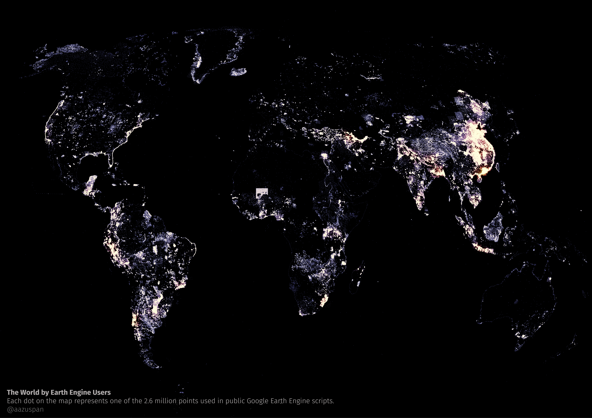

# 🌍 Earth Engine Public Repository Stats

This project contains notebooks to scrape, parse, and analyze every public [Google Earth Engine](https://earthengine.google.com/) repository. 

## 📈 Stats

You can use the scripts and data here to dig deeper, but here are some summary stats as of March 2022.

### 🌐 Earth Engine Stats
- **11,175** public repositories
- Contributed by **8,344 users**
- **57 million** lines of code
- **13 million** lines of comments

### 🛰️ Dataset Stats

- The most popular single image collection is [Sentinel-2 Level 1C](https://developers.google.com/earth-engine/datasets/catalog/COPERNICUS_S2) with **39k imports** 
- By program, **Landsat** wins with **134k imports**
- **Landsat 8** is the most frequently imported Landsat platform with **67k imports**

### 🖥️ Module Stats

- External modules have been imported 35k times
- The most popular import is [ee-palettes](https://github.com/gee-community/ee-palettes), followed by [GEET](https://github.com/sacridini/GEET) and [GEE Tools](https://github.com/fitoprincipe/geetools-code-editor).

### 📋 Other Stats

- The most frequently used coordinate reference systems are Mercator and Web Mercator, which together make up 91% of all CRS's used

## Usage

You can follow the steps below to recreate the analysis.

1. Use [notebooks/001_scraping_repositories]() to clone all Earth Engine repositories to local storage.
2. Use [notebooks/002_summarizing_code]() to count lines of code.
3. Use [notebooks/003_parsing_code]() to parse all of the source code and build lists of commonly used image collections, modules, points, etc. Export those lists for future use (you can find some of them pre-made in [data]()).
4. Use [notebooks/004_dataset_stats]() to analyze which datasets are used most commonly.
5. Use [notebooks/005_module_stats]() to analyze which modules are imported most frequently.
