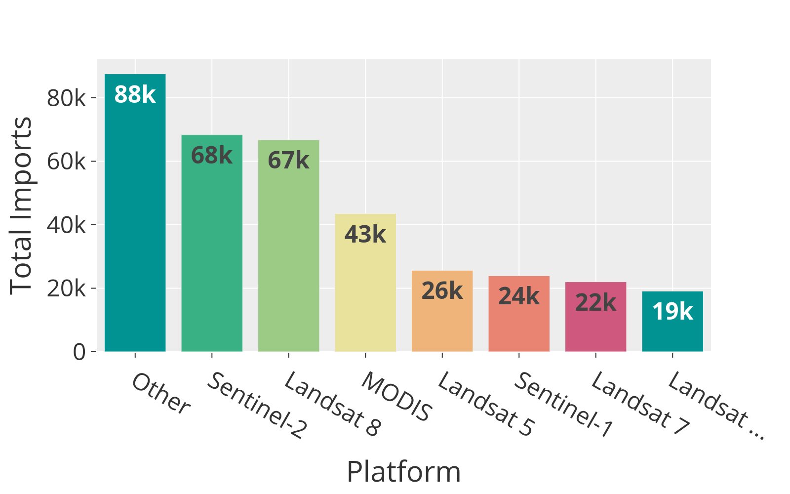
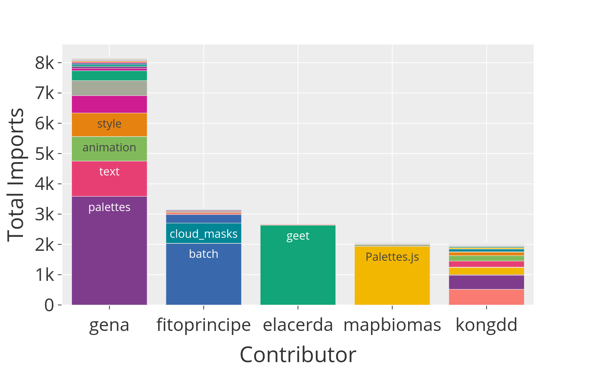

# 🌍 Earth Engine Public Repository Stats

This project contains [notebooks](./notebooks) that were used to scrape, parse, and analyze every public [Google Earth Engine](https://earthengine.google.com/) repository. It also contains most of the raw [data](./data) that was created in the process.

## Background

Google Earth Engine (GEE) is a cloud-computing platform for remote sensing and geospatial analysis that is widely used for scientific research and natural resource management. Some (probably a small fraction) of the code that users have written in GEE is publicly accessible, so I decided to download all ~11 gigabytes of it to see what I could learn about how people are using the platform. The stats and data here are a snapshot of public repositories in March 2022.

## 📈 Stats

### 🌐 Earth Engine Stats
- **11,175** public repositories
- Contributed by **8,344 users**
- **57 million** lines of code

### 🛰️ Image Collection Stats

- The most frequently imported platform is [Sentinel-2](https://developers.google.com/earth-engine/datasets/catalog/COPERNICUS_S2) with **68k imports** 
- Together, **Landsat** platforms have been imported **134k times**, with half of those imports being **Landsat 8**.

### 🖼️ Image Stats
- Overall, the most frequently imported image is [NASA SRTM 30m elevation data](https://developers.google.com/earth-engine/datasets/catalog/USGS_SRTMGL1_003).
- The most frequently imported *Landsat* image is `ee.Image("LANDSAT/LC08/C01/T1_TOA/LC08_044034_20140318")`.
- For obvious reasons, this incredible scene over the northern Australian coast is the most frequently imported Sentinel-2 image: `ee.Image("COPERNICUS/S2/20180422T012719_20180422T012714_T52LHM")`.

### 🖥️ Module Stats

- External modules have been imported **35k times**
- The most popular import is [ee-palettes](https://github.com/gee-community/ee-palettes), followed by [GEET](https://github.com/sacridini/GEET) and [GEE Tools](https://github.com/fitoprincipe/geetools-code-editor).

### 📋 Other Stats

- The most frequently used coordinate reference systems are Mercator and Web Mercator, which together make up **91%** of all CRS's used.
- 2019 is the most frequently used year.

## Usage

Most of the tabular data is already accessible in the [data](./data) folder, but if you want to modify the analysis, you can follow the steps below to run it yourself.

1. Use [notebooks/001_scraping_repositories](notebooks/001_scraping_repositories.ipynb) to clone all Earth Engine repositories to local storage.
2. Use [notebooks/002_summarizing_code](notebooks/002_summarizing_code.ipynb) to count lines of code.
3. Use [notebooks/003_parsing_code](notebooks/003_parsing_code.ipynb) to parse all of the source code and build lists of commonly used image collections, modules, points, etc. Export those lists for future use (you can find most of them pre-made in [data](./data)).
4. Use [notebooks/004_dataset_stats](notebooks/004_dataset_stats.ipynb) to analyze which datasets are used most commonly.
5. Use [notebooks/005_module_stats](notebooks/005_module_stats.ipynb) to analyze which modules are imported most frequently.
